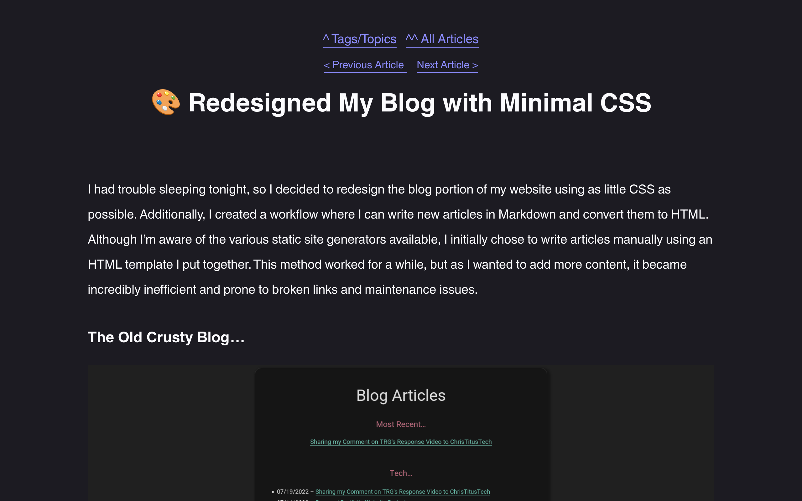

# kj_sh604's Hugo Theme (kj_shugo)

a VERY minimal Hugo theme that I use on my [blog](https://aedrielkylejavier.me/articles/) and [scripts/tools](https://aedrielkylejavier.me/scripts-and-tools/) sites.

## features:
*  generates an rss feed with a `Makefile` (`public/rss.xml`)
* dead simple stylesheet (`static/style.css`)
* responsive web design for mobile and desktop (see screenshots)
* dynamic navigation with `topnav` and `nextprev` (good for blogs)
* decent amount of code and configuration comments to make it as self-documenting as possible.
* dark mode and light mode (based on site visitors' system settings)
    * this is not done with CSS; rather, it is achieved with a simple `<meta>` tag:
        * `<meta name="color-scheme" content="dark light">`

## screenshots

**deskop site**


***with example content*** *([aedrielkylejavier.me/scripts-and-tools](https://aedrielkylejavier.me/scripts-and-tools/))*


***example blog site*** *with* `datesinlist = true` *in* `hugo.toml` *([aedrielkylejavier.me/articles/](https://aedrielkylejavier.me/articles/))*


***example blog post*** *([aedrielkylejavier.me/articles/2023-01-06_blog-redesign](https://aedrielkylejavier.me/articles/2023-01-06_blog-redesign/))*



**mobile site (responsive)**


## usage

### theme installation

```bash
hugo new site [YOUR SITE NAME]
cd [YOUR SITE NAME]
git clone https://github.com/kj-sh604/kj_shugo.git themes/kj_shugo
# copy css to the parent directory
cp themes/kj_shugo/static/style.css static/
# copy Makefile to parent directory (for rss feed generation)
cp themes/kj_shugo/Makefile ./
# be careful with the next command(s) 
# remove the .git directory in themes/kj_shugo
rm -rf themes/kj_shugo/.git
# remove assets/ directory (not necessary for the theme)
rm -r themes/kj_shugo/assets
```

you can now declare `theme = ['kj_shugo']` in your `hugo.toml` file to use the theme.

see [`themes/kj_shugo/hugo.toml`](https://github.com/kj-sh604/kj_shugo/blob/master/hugo.toml) for configuration options and parameters.

### generate rss feed

* run the following in the hugo working directory (where `Makefile` is located)
```bash
make
```
⚠ **Disclaimer:** this Makefile originally used `sed -i`, which works as expected on GNU/Linux. However, I have not been able to test its behaviour on macOS or the BSDs. I have rewritten it to avoid using any OS-specific arguments (`-i` in this case), but it remains untested at this time. Therefore, please exercise caution when running `make` on these operating systems.

### creating a new page

```bash
hugo new content [TITLE OF WEBPAGE].md
```

## additional links and info

* [Hugo's Documentation Site](https://gohugo.io/documentation/).
* [Hugo's Templates Documentation](https://gohugo.io/templates/).
* See the theme in action on my:
    * [Blog Site](https://aedrielkylejavier.me/articles/)
    * [Scripts & Tools Site](https://aedrielkylejavier.me/scripts-and-tools/)
    * ["No Javascript" Version of my Website](https://aedrielkylejavier.me/noscript/)
