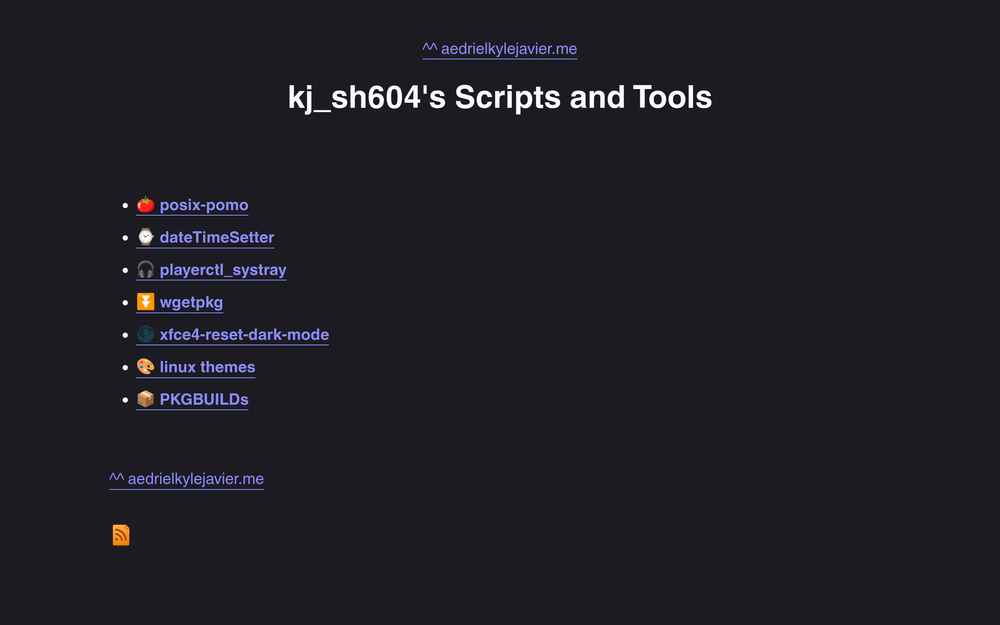

# kj_sh604's Hugo Theme (kj_shugo)

a VERY minimal Hugo theme that I use on my [blog](https://aedrielkylejavier.me/articles/) and [scripts/tools](https://aedrielkylejavier.me/scripts-and-tools/) sites.

# features:
* dead simple stylesheet (`static/style.css`)
* responsive web design for mobile and desktop (see scrots)
* dynamic navigation with `topnav` and `nextprev` (good for blogs)
* decent amount of code and configuration comments to make it as self-documenting as possible.
* generates an rss feed with a `Makefile` (`public/rss.xml`) 
* dark mode and light mode (based on site vistors' system settings)
    * this is not done with CSS; rather, it is achieved with a simple `<meta>` tag:
        * `<meta name="color-scheme" content="dark light">`

# `scot`s

**deskop**

**mobile**

**with content** *([aedrielkylejavier.me/scripts-and-tools](https://aedrielkylejavier.me/scripts-and-tools/))*

    * this `Makefile` originally used `sed -i` which works as expected on GNU/Linux. However, I have not been able to test its behaviour on macOS and the BSDs. I've rewrote it to not utilize any OS specific arguments (`-i` in this case), but it's still untested at the moment. So please be very careful when running `make` when you're on those OSs.
